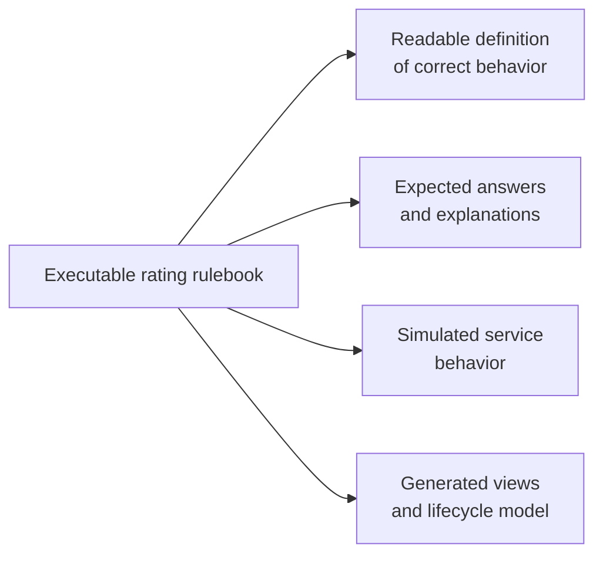
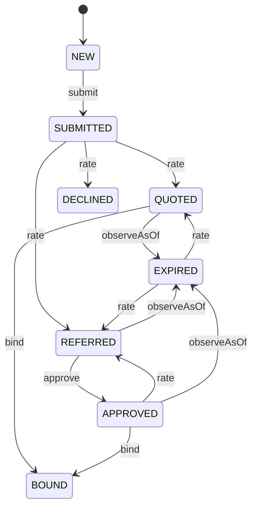
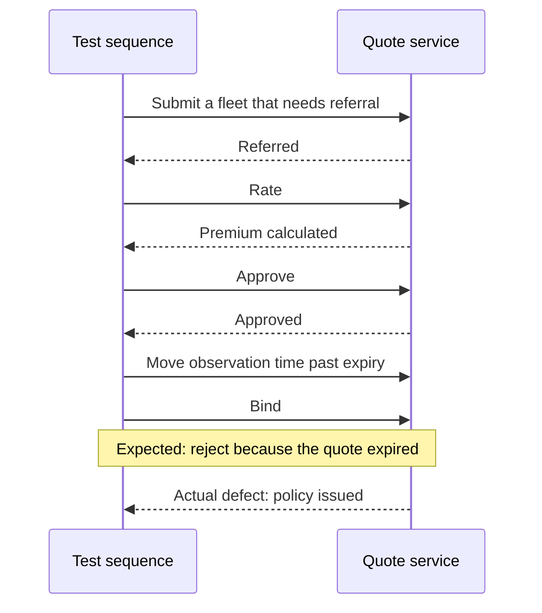

# fleetquote tutorial — from one rating to the whole lifecycle

This tutorial follows a commercial fleet insurance quote from calculation through referral, approval, expiry and
binding. You describe the business intent; the product turns it into rules the computer can run, and shows you the
calculations, diagrams, test data and lifecycle behaviour that follow. Nothing below asks you to draw a flowchart,
write a state machine by hand, or paste an expected premium into a test.

## What you will see

- [Use one rulebook for four jobs](#1-one-artifact-four-jobs)
- [Calculate and explain one quote](#2-run-one-rating)
- [See the flowchart and table nobody maintained](#3-see-the-model-you-didnt-draw)
- [Generate meaningful test inputs](#4-learn-the-input-space)
- [Ask the rules to find their own gaps](#5-let-the-rules-critique-themselves)
- [Turn rating rules into a quote lifecycle](#6-now-the-lifecycle)
- [Find an order-dependent service defect](#7-walk-it)
- [See the full impact of one rate change](#8-change-one-rate)
- [What this demonstrated](#9-what-this-demonstrated)

*Technical note.* Serve the project first — see **Run it** in `README.md`. Every block below runs in that interactive
workspace; an AI agent runs the same calls over the `/api/eval` and `/api/mcp` programmatic interfaces.

## 1. One artifact, four jobs

The **rulebook** is the agreed way to calculate and explain a quote. Because it can run, the same rules also predict
correct results, power a simulated service, and generate the views used later here. `rulebooks/rating/calc.js` holds
the Stonebridge rating rules — rate tables first, then the decisions in the guide's own order. Four jobs at once:

- **the written definition of correct behaviour** — `calc.label` names each rule, `calc.req` links each decision
  result to the requirement it demonstrates;
- **the calculator that determines the expected answer** — so no check in this kit hard-codes a premium;
- **the rules behind the simulated service** — `mock/handlers.js` calls `Rule.execute('rating', submission)`;
- **the model behind every view below** — each diagram and table is generated from these rules.



*Change the rulebook once, and all four uses change together.* The practical benefit is that a rate change cannot
leave four separately maintained artifacts quietly disagreeing.

## 2. Run one rating

Start with one fleet submission: the rulebook returns the premium, the outcome, and which requirements it used.

```js
var quote = { territory: 'urban', vans: 2, lightTrucks: 1, heavyTrucks: 0, avgExperience: 5,
              safetyProgram: false, claimsCount: 0, hazmatCargo: false,
              youngestDriverAge: 30, outOfStateOperations: false }

var r = Rule.execute('rating', quote)
r.output      // -> { premium: 2422, reason: null }
r.outcome     // -> 'rated'
r.reqs        // -> ['FLEET-003/1','FLEET-003/2','FLEET-003/3','FLEET-004/3','FLEET-006/3','FLEET-008/1']
```

`reqs` is a free link from the result back to the requirements: the decisions this quote took name the business
requirements they demonstrate. The rules also write their own step-by-step calculation explanation as they run:

```js
Rule.audit('rating', quote, { output: 'markdown' }).markdown
// # Fleet base premium
// - 2 cargo vans in urban territory: 1525
// - 1 light trucks in urban territory: 896.9999999999999
// - fleet base premium (sum over vehicles): 2422
// # Driver experience
// - average experience 5 years: no adjustment
// # Minimum premium and rounding
// - computed 2422 -> floored at minimum 390: 2422
```

The answer *and* the reasoning, in the underwriter's words. When the real service returns a different number, this
shows exactly where the two calculations diverged, and a reviewer can then decide which one matches the rule.

## 3. See the model you didn't draw

Next the same rulebook becomes two review views: a flowchart for following decisions, a table for what it covers.

```js
var d = Rule.diagram('rating')
d.outline           // -> 10 items in the diagram outline: the '#' sections and the big decisions
d.collapsed         // -> ['L35#0','L54#0']  — two large parts of the flowchart start folded
d.svg               // the rendered flowchart; d.mermaid is the same graph as text

var t = Rule.table('rating')
t.stats             // -> { rows: 22, scenarios: 22, generated: 0, distinctPaths: 13 }
t.columns.decisions // -> 12 columns named by calc.label: 'Young-driver exclusion',
                    //    'Fleet-size discount', 'Surcharge cap', 'Referral to underwriting' …
Rule.table('rating', { output: 'markdown' }).markdown
```

The flowchart is generated from the rules, not maintained beside them, and is read-only on purpose: a diagram you
can edit becomes a second authoritative version, and second versions quietly become inconsistent. The table shows 22
saved examples taking only **13 different routes** — it groups examples that produced the same sequence of decision
results, so duplicated coverage is visible instead of counted twice. The two views let business and test reviewers
inspect the same logic without maintaining separate diagrams or spreadsheets.

## 4. Learn the input space

Now the engine looks for meaningful test values: limits, values beside them, and combinations that expose interactions.

```js
Rule.ranges('rating').dimensions    // -> 10 input fields, each with the value ranges expected to behave the same way

Rule.explore('rating').summary
// -> RulePathExplorer: 28/28 site-outcomes (100%), suite of 0 rows, 1 rounds, 120 runs
//    youngestDriverAge (number): [18, 22, 23, 24, 25, 70]
//    avgExperience     (number): [0, 1, 2, 3, 4, 7, 8, 9, 10, 30]
```

For `youngestDriverAge` the ranges read `= 18 · 18–23 · = 23 · = 24 · 24–70 · = 70`. The repeated endpoints are
deliberate: the limit itself is tested as well as the values either side of it, because behaviour often changes
exactly there. Two origins are mixed into the explored values. `generator.js` declares the *allowed input range* and
the values the business already cares about — for age, `18` to `70` with `23` and `24` called out. The rest (`22`
and `25` here; `1`, `4`, `7` and `10` around the two experience bands) appear because the engine watched each
comparison as the rules ran, learned where the decision changes, and stepped across it — never written down anywhere.

`28/28 site-outcomes` means every possible result at every decision point was reached, and `suite of 0 rows` is the
honest reading of that: the 22 saved examples already reach all of them, so the generator has nothing to add. Ask
for a complete generated test set instead, then attach the answers by running each row through the rulebook:

```js
Rule.explore('rating', { suite: 'boundary' }).suite.length    // -> 38  values at and beside each limit
var deck = Rule.explore('rating', { suite: 'pairwise' }).suite
deck.length                                                   // -> 97  every pair of field choices appears together

var rows = []
for (var i = 0; i < deck.length; i++) {
  var input = deck[i].input
  if (deck[i].domain === 'out') continue                                  // outside the allowed input range
  if (input.vans + input.lightTrucks + input.heavyTrucks < 1) continue    // no vehicles: not a quotable risk
  var x = Rule.execute('rating', input)
  rows.push({ input: input, outcome: x.outcome, premium: x.output.premium, reqs: x.reqs })
}
rows.length     // -> 31
```

Rows outside the allowed range, and rows describing no vehicles, are filtered out — leaving 31 usable quote examples,
each with its expected premium, outcome and requirement links: test data with the answers attached, generated.

## 5. Let the rules critique themselves

Before trusting the rulebook, ask whether any rule is unused, unreachable, stuck on one answer, or breaks a guarantee.

```js
var c = Rule.check('rating')
c.verdict                 // -> { status: 'CLEAN', findings: 0, review: 0, reasons: [] }
c.notused                 // -> []   rule choices a valid input can reach, but no saved example covers
c.notreachable            // -> []   rule choices no valid input can reach at all
c.deadBranches            // -> []   decisions that can only ever produce one answer
c.notproduced             // -> []   declared results that never occur
c.properties
// 'a declined quote has no premium'            always     HOLDS  checks 53, searched 424
// 'a priced premium is at least the minimum'   always     HOLDS  checks 53, searched 424
// 'minimum premium floor engaged'              sometimes  satisfied 1 + the witness input
```

A **property** is a business guarantee checked across many inputs, and there are two kinds. An `always` guarantee
looks for any counterexample — a violation comes back with the smallest input that breaks it. A `sometimes`
guarantee looks for at least one concrete example proving the situation can occur; one never reached is reported as
a gap rather than quietly passing. Beside the 53 in-range evaluations, the checker reports 424 more used while
hunting for violations. `c.notderivable` lists the grey areas honestly — comparisons on values calculated from other
inputs (the vehicle total, the computed premium) that no single input field explains; informational, never a
misleading pass. Clean therefore means more than "the saved examples passed": unreachable logic is reported too, and
counterexamples are actively hunted.

## 6. Now the lifecycle

Everything so far priced *one* submission. The rest of the answer depends on what happened before: a quote must be
rated before it binds, a referral needs approval, a declined quote is terminal, a rated quote goes stale after 60
days. The lifecycle has eight recognizable situations — **new, submitted, quoted, referred, approved, declined,
expired** and **bound** — and the next step turns the guide into explicit rules for moving among them.

That intent is prose today: section 5 of `SOT-prose.md`, plus the named rejection reasons listed in `README.md`.
This kit deliberately ships **no** model of it. You ask for one:

> Read section 5 of `SOT-prose.md` and the rejection reasons in `README.md`, and write me a twin of the quote
> lifecycle: the states the guide names, one business operation per endpoint, the condition that allows or rejects
> each one, and the facts that must always remain true. Price every rated step through the `rating` rulebook, not
> with your own arithmetic; grade it against `acceptance.json` and show me what you reached.

A **twin** is a behavioural model: a small map of the quote's situations and the operations allowed in each. Your
agent pulls the build instructions itself (`Skill.help('twin-authoring')`, `Twin.help()`) and produces a `twin.js`
shaped like this:

```js
t.state('QUOTED',  function (w) { return w.status === 'QUOTED' && !isExpired(w); })
t.state('EXPIRED', function (w) { return isExpired(w); })

t.command('bind', {
    when: function (w) { return w.status !== 'NEW'; },
    apply: function (w) {
        if (w.status === 'SUBMITTED') { t.reject(BIND_NOT_RATED); }
        if (isExpired(w))             { t.reject(BIND_EXPIRED); }
        if (w.status === 'REFERRED')  { t.reject(BIND_APPROVAL); }
        w.status = 'BOUND';
    },
    request: function (w) { return { method: 'POST', path: '/quotes/' + w.quoteId + '/bind' }; }
})

t.always('a bound quote carries a premium', function (w) {
    return w.status !== 'BOUND' || (w.premium !== null && w.premium > 0);
})
```

It installs that with `Rule.twin.update('rating', source)`. Technical readers can inspect the model; everyone else
can review the behaviour it produces:

```js
var e = Twin.explore('rating')
e.states                    // -> reached: NEW SUBMITTED QUOTED REFERRED APPROVED DECLINED EXPIRED BOUND
                            //    notReached: []
e.transitions.observed      // -> 23 observed moves, each { from, command, to }
e.transitions.notObserved   // -> []
```



*Drawn from the exploration's own `transitions.observed` list — the 13 moves that change state. The other 10 observed
moves return to the state they started in (a clock tick that does not expire the quote, a re-rate that lands back
where it was) and are left out for legibility.* `DECLINED` and `BOUND` have no outgoing arrows: the guide makes them
terminal. If an expected state is missing, there is a focused question to investigate — is the model incomplete, is
the exploration limit too low, or is the expected lifecycle itself unclear?

## 7. Walk it

### Explore every short path

```js
e.ceilings      // -> { hit: 'exhausted', usage: { maxDepthReached: 6, nodesVisited: 90, … } }
e.stats         // -> { nodes: 90, edges: 270, refusals: 730, errors: 0 }
e.fidelity      // -> steps: { oracle: 46, bare: 224 }, clock: 'declared'
```

The explorer tried every command sequence it could reach within a six-step limit and had none left unexplored inside
that limit — that is what `hit: 'exhausted'` reports. It examined 90 distinct situations and 270 moves between them;
`fidelity.steps` splits those by who supplied the expected answer — 46 priced by the rulebook, 224 lifecycle-only.

**730 refusals** is the by-product nobody writes by hand: each is an operation attempted in a situation where the
model's condition rejects it — binding before rating, binding a declined quote, approving something never referred,
acting on an expired quote. Once the model is accepted as correct, that becomes a reusable collection of attempts
the real service should reject, with no negative test authored by hand.

### Check the required business examples

```js
var c = Twin.check('rating', { required: read('/acceptance.json') })
c.required.rows                  // -> 40   business examples the guide demands
c.requiredWitness.length         // -> 39   reached, each with the shortest sequence that shows it
c.findings.requiredUnreached     // -> [ { id: 'T18', kind: 'transition', status: 'unreached' } ]
c.ci                             // -> { verdict: 'FAIL', reasons: ['required T18 (transition) unreached'] }
```

39 of the 40 required examples are demonstrated. `T18` — binding on the *exact* 60th day — is not. The required set
asked for a demonstration the model never gave: a finding about the model, not a flaky test.

### Compare with the running service

Those shortest sequences are saved (`Rule.sequence.create`) as ordered command sequences whose order must not
change, and replayed against a running service:

```js
var mock = File.call('/mock/start.js', { rollout: true })   // a seeded defect rides this option
Twin.live('rating', { baseUrl: mock.url, against: 'live' }).summary
// -> { PASS: 42, FAIL: 1, UNRESOLVED: 0, exchanges: 248, wireRefusals: [ … ] }
```

`wireRefusals` are the rejections the running service actually returned; `UNRESOLVED` would count a replay that could
not be settled either way. Here: one real disagreement. First replay the model's expected five-step path — it says
the final bind must be refused because the quote expired:

```js
Twin.run('rating', 'seq-bind-expired-approved').steps
// submit  { label: 'referred', heavyTrucks: 20, … }  -> applied   EXPECTED
// rate    {}                                          -> applied   premium 30037.5, status REFERRED
// approve {}                                          -> applied   status APPROVED
// observeAsOf { day: 61 }                             -> applied   clock moved past the 60-day window
// bind    {}                                          -> refused   'the quote is expired and must be
//                                                                   re-rated before any further action'
```

The live service accepted that same final bind. Its recorded response to the fifth step:

```js
var log = read('/rulebooks/rating/.baseline/live.json').runs['seq-bind-expired-approved'].log
var last = log[log.length - 1];
({ request: last.observed.request, status: last.observed.response.status,
   quoteStatus: last.observed.response.body.status,
   policyNumber: last.observed.response.body.policyNumber })
// -> { request: { method: 'POST', path: '/quotes/Q-100039/bind' },       ACTUAL
//      status: 200, quoteStatus: 'bound', policyNumber: 'POL-100039' }
```

Expected a refusal; the service issued policy `POL-100039`.



This defect appears only after this exact order of events: refer, approve, wait, then bind. The service correctly
rejects other expired quotes — the same lapse *is* refused when the quote is merely rated, and *is* refused on
`approve` — but it forgets the expiry check after approval. A test that checks bind in isolation is unlikely to
expose an order-dependent defect. Restart the mock without the option — `File.call('/mock/start.js')` — and it clears.

## 8. Change one rate

The last failure mode is the quiet one: a rule starts producing different business results while every test stays
green. Save today's behaviour as the approved baseline, then change a number.

```js
Rule.bless('rating')       // -> { scenarios: 22, rejects: 0, invariants: 4, sequences: 43 }
```

Now edit `calc.js` — raise the heavy-truck base rate from `1250` to `1290` — and ask what moved:

```js
var d = Rule.drift('rating')
d.changed          // -> true
d.outputDrift      // -> 5   same example, different calculated premium, with the precise
                   //        before-and-after values: 3952 -> 3992, 3347 -> 3401, …
d.outcomeDrift     // -> 1   same example, different business classification:
                   //        'rated-just-under-referral'  rated -> referred
d.sequenceDrift    // -> 11  saved lifecycle sequences that now end differently
```

Read the `outcomeDrift` line again. A $40 increase to the heavy-truck base rate silently pushed one quote across the
referral threshold — it now needs an underwriter — and eleven saved lifecycle sequences end somewhere new. Nothing
failed; nothing was edited except one rate. The drift report brings those otherwise green behavioural changes into
one reviewable list, and `Rule.bless('rating')` accepts them when intended. This is change-impact analysis: not only
which premiums moved, but which approvals and lifecycle outcomes may now require review.

## 9. What this demonstrated

One executable rulebook has now calculated and explained a quote, generated review views and test data, checked its
own guarantees, powered a lifecycle model, exposed an order-dependent service defect, and measured the impact of a
rate change. The value is not any single view; it is that all of them stay tied to the same business rules. Two ways on:

- Open the same project in the console — every view here has a pane there: the flowchart with its coverage overlay,
  the decision table, value ranges, the twin, and the what-if workspace.
- Read `README.md` for the kit's surface, the simulated service, the movable clock, and the checks joining them.
