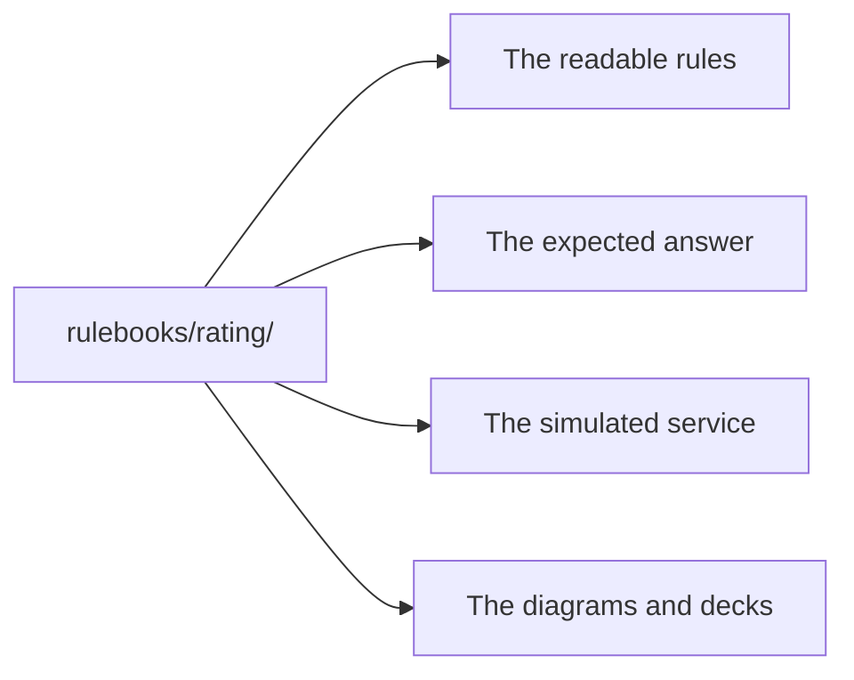

# Evaluate karate-agent on the fleetquote kit

This tutorial is an evaluation path. Each section asks one question. Each section gives the commands and
the output the engine produces. A test runs every call below. The test asserts every number shown.

## 1. What this kit is, and how to start it

Stonebridge Fleet Auto rates commercial vehicle fleets. Submit a quote. Rate it. Refer and approve it
when required. Bind it into a policy. The **rulebook** `rulebooks/rating/` is the only pricing authority
in the kit. It does four jobs at once. One rule change updates the calculation, the service, the
diagrams, and the test data.



Start the console. Read **Run it** in `README.md` for the command. Type each block into the console. An
agent uses `/api/eval` or `/api/mcp` for the same calls.

## 2. Ask the rules for an answer, and its audit trail

```js
var quote = { territory: 'urban', vans: 2, lightTrucks: 1, heavyTrucks: 0, avgExperience: 5,
              safetyProgram: false, claimsCount: 0, hazmatCargo: false,
              youngestDriverAge: 30, outOfStateOperations: false }
var r = Rule.execute('rating', quote)
r.output    // -> { premium: 2422, reason: null }
r.outcome   // -> 'rated'
r.reqs      // -> ['FLEET-002/4','FLEET-003/1','FLEET-003/2','FLEET-003/3','FLEET-004/3',
            //     'FLEET-006/3','FLEET-008/1','FLEET-009/2']

Rule.audit('rating', quote, { output: 'markdown' }).markdown
// # Fleet base premium
// - 2 cargo vans in urban territory: 1525
// - fleet base premium (sum over vehicles): 2422
// # Driver experience
// - average experience 5 years: no adjustment
// …
// - computed 2422 -> floored at minimum 390: 2422
// - final premium rounded to the cent: 2422
```

`reqs` names the acceptance criteria this quote demonstrates. When a service returns a different number,
compare it with the audit. The first differing step names the cause.

## 3. See the rules as a diagram and a table

```js
var d = Rule.diagram('rating')
d.outline.length             // -> 10   outline items
d.collapsed                  // -> ['L36#0','L56#0']   two large branches start folded
d.svg                        // the flowchart; d.mermaid is the same graph as text

var t = Rule.table('rating')
t.stats                      // -> { rows: 22, scenarios: 22, generated: 0, distinctPaths: 13 }
t.columns.decisions.length   // -> 12   one column per named decision
Rule.table('rating', { output: 'markdown' }).markdown
```

The engine generates both views from the rules. Nobody maintains them beside the rules. The 22 saved
scenarios take only 13 distinct paths, so duplicated coverage stays visible.

## 4. Get test data with the answers filled in

```js
Rule.ranges('rating').dimensions.length   // -> 10   input fields, each split into value classes
// youngestDriverAge classes: = 18 · 18–23 · = 23 · = 24 · 24–70 · = 70

Rule.explore('rating').summary
// -> RulePathExplorer: 28/28 site-outcomes (100%), suite of 0 rows, 1 rounds, 120 runs

Rule.explore('rating', { suite: 'boundary' }).suite.length   // -> 38
var deck = Rule.explore('rating', { suite: 'pairwise' }).suite
deck.length                                                  // -> 97
```

The boundary suite includes each limit and the values beside it. `28/28 site-outcomes` means the saved
scenarios reach every decision arm. No additional rows are required. Run each usable row through the
rulebook to attach the answers.

```js
var rows = deck.filter(function (x) {
  return x.domain !== 'out' && x.input.vans + x.input.lightTrucks + x.input.heavyTrucks > 0
}).map(function (x) {
  var y = Rule.execute('rating', x.input)
  return { input: x.input, outcome: y.outcome, premium: y.output.premium, reqs: y.reqs }
})
rows.length     // -> 31
```

Each row carries its expected result, its outcome, and the criterion ids it demonstrates.

## 5. Is the rulebook complete and healthy?

```js
var c = Rule.check('rating')
c.verdict         // -> { status: 'CLEAN', findings: 0, review: 0, reasons: [] }
c.unclaimed       // -> []   decision arms no acceptance criterion claims
c.notused         // -> []   arms a valid input reaches, but no saved scenario covers
c.notreachable    // -> []   arms no valid input can reach
c.deadBranches    // -> []   decisions that can only ever produce one answer
c.notproduced     // -> []   declared outcomes that never occur
c.properties
// 'a declined quote has no premium'            always     HOLDS  checks 53, searched 424
// 'a priced premium is at least the minimum'   always     HOLDS  checks 53, searched 424
// 'minimum premium floor engaged'              sometimes  satisfied 1 + the witness input
```

A **property** is a business guarantee checked over many inputs. The engine searches each `always`
guarantee for a counterexample. A violation returns the smallest failing input. A `sometimes` guarantee
needs one witness. A situation never reached is reported, not passed.

**Try it.** Delete the line `calc.req('FLEET-009/2');` from `rulebooks/rating/calc.js`. Run the check
again. Restore the line afterwards.

```js
Rule.check('rating').verdict
// -> { status: 'REVIEW', findings: 0, review: 1,
//      reasons: ['1 decision arm(s) no requirement claims — see unclaimed'] }
Rule.check('rating').unclaimed
// -> [ { label: 'Referral to underwriting', line: 145, outcome: false, source: 'if(premium>…' } ]
```

That arm now decides something no acceptance criterion mentions. The engine reports `REVIEW`, never a
defect. It cannot tell a missing criterion from a rule to delete.

## 6. Does the schema refuse bad input?

`rulebooks/rating/schema.js` declares the input shape. Three rows in `scenarios.json` carry the marker
`_expect: 'schema-reject'`. Each row claims the shape refuses it.

```js
Rule.check('rating').rejects
// [ { _id: 'reject-unknown-territory',           status: 'REFUSED', pass: true,
//     why: "the schema refused it: $.territory is 'coastal' — not one of ['urban', 'suburban', 'rural']…" },
//   { _id: 'reject-vans-not-a-number',           status: 'REFUSED', pass: true,
//     why: 'the schema refused it: $.vans not a number…' },
//   { _id: 'reject-safety-program-not-boolean',  status: 'REFUSED', pass: true,
//     why: 'the schema refused it: $.safetyProgram not a boolean…' } ]

Rule.check('rating').accepts
// -> { status: 'ACCEPTED', checked: 22, incomplete: 0, refused: [] }
```

`REFUSED` confirms the rejection. `ACCEPTED` shows a loose shape. `NOTCHECKED` marks a row with no
business input. `accepts` proves the same shape still admits all 22 valid scenarios. A shape that refuses
everything cannot read green.

## 7. Pin the analyst's figures

An unpinned scenario uses the current rule result. Add `_expect` to keep an approved result.

```js
// scenarios.json, on the row 'baseline-suburban-mixed':
//   "_expect": { "output": { "premium": 3952 }, "outcome": "rated" }
// three more rows pin: null declined · 390 rated · 30037.5 referred

Rule.check('rating').expectations
// -> { status: 'MATCHED', checked: 4, failed: [] }
```

A rule change that moves a pinned figure reads `MISMATCHED`. The message does not say which artifact is
wrong.

## 8. Would your tests notice a broken rule?

Mutation testing seeds defects into a copy of the rulebook. It then asks whether anything notices.

```js
var m = Rule.mutate('rating')
m.counts                     // -> { KILLED: 28, SURVIVED: 15, SCREENED: 13, INVALID: 0 }
m.denominator                // -> 43
m.selfRunScore               // -> 0.6512
m.rawKillRate                // -> 0.6512   every notice, a stored pin included
m.independentScore           // -> 0.1395   only what a guarantee noticed
m.oracleBook.always.length   // -> 4   the guarantees that graded
m.oracleBook.expectations    // -> 4   the pinned figures that graded

m.mutants.filter(function (x) { return x.status === 'KILLED' })[6].id
// -> 'CONDITIONALS_BOUNDARY@L36#0'      the young-driver limit moving from 23 to 22
m.worklist[6]
// -> id: 'INLINE_CONSTANT@lookup.claims.perClaim'
//    finding: "nothing in the rulebook's own oracle book would notice
//              lookup.claims.perClaim changing (0.17 -> 0.34)"
//    fix: 'store the counterexample row as a scenario with an _expect, or declare the
//          calc.always property that forbids it'
```

The oracle notices 28 of 43 graded mutants. 15 mutants change a rule and nothing notices. `SCREENED`
mutants are indistinguishable on the enumerated deck and sit outside the score. Remove the four pins of
section 7. The score falls to `0.1395`, and the run kills 6 mutants.

## 9. Test the lifecycle, not just the price

The answer depends on the earlier commands. A quote must be rated before it binds. A referral needs
approval. A declined quote is terminal. A rated quote expires 60 days after its rating date.

`rulebooks/rating/twin.js` models that lifecycle. It declares 8 states and 5 commands. Each command
carries the condition that allows or refuses it. The model also declares the facts that stay true.
Compare the model with the prose guide and `acceptance.json`.

```js
var e = Twin.explore('rating')
e.states.reached         // -> NEW SUBMITTED QUOTED REFERRED APPROVED DECLINED EXPIRED BOUND
e.states.notReached      // -> []
e.transitions.observed   // -> 23 transitions, each { from, command, to }
e.ceilings.hit           // -> 'exhausted'   no new path exists within the depth limit
e.stats                  // -> { nodes: 90, edges: 270, refusals: 730, errors: 0 }
e.fidelity.steps         // -> { oracle: 46, bare: 224 }
```

Each refusal records a command the model rejects, for example a bind before rating. Use them as
generated negative-test candidates.

```js
var c = Twin.check('rating', { required: JSON.parse(File.read('/acceptance.json')) })
c.required.rows                // -> 40   business examples the guide demands
c.requiredWitness.length       // -> 39   reached, each with the shortest order that shows it
c.findings.requiredUnreached   // -> [ { id: 'T18', kind: 'transition', status: 'unreached' } ]
c.ci                           // -> { verdict: 'FAIL', pass: false,
                               //      reasons: ['required T18 (transition) unreached'] }
c.transitionPairs              // -> { covered: 12, of: 508 }
c.evidence                     // -> model 8/8, oracle 46/270, mock 0/43, live 0/43
```

`T18` binds on the exact 60th day, and the walk never reached it. Add a saved sequence that binds on day
60 to close it. `transitionPairs` counts two-step orders the saved sequences walk. Each remaining pair
carries the shortest sequence that closes it.

Now replay the 43 pinned sequences against the running service. The `rollout` option seeds one defect.

```js
var mock = File.call('/mock/start.js', { rollout: true })
Twin.live('rating', { baseUrl: mock.url, against: 'live' }).summary
// -> { PASS: 42, FAIL: 1, UNRESOLVED: 0, exchanges: 248, wireRefusals: [ … ] }
// the one failure:
// { sequenceId: 'seq-bind-expired-approved', disposition: { kind: 'FAIL', at: 4,
//   mismatch: { kind: 'noCandidateExplainsObservation', outcome: 'applied' } } }

Twin.run('rating', 'seq-bind-expired-approved').steps
// submit      { label: 'referred', heavyTrucks: 20, … }  -> applied
// rate        {}                                          -> applied
// approve     {}                                          -> applied
// observeAsOf { day: 61 }                                 -> applied
// bind        {}                                          -> refused
//             'the quote is expired and must be re-rated before any further action'
```

The model refuses the final bind. The service accepted it and issued a policy. The defect needs this
order: refer, approve, wait, then bind. A test of `bind` alone cannot reach it. Stop the mock. Start it
without `rollout`. Run `Twin.live` again: all 43 sequences pass.

## 10. Trace it to requirements

```js
Rule.cover('rating')
// -> { rules: 'rating', scenarios: 22, criteria: 20,
//      byStatus: { req:   { COVERED: 8, FAILING: 0, NOTRUN: 0, NOTCOVERED: 8 },
//                  rules: { COVERED: 22, FAILING: 0, NOTRUN: 0, NOTCOVERED: 0 } } }

Requirement.matrix().requirements
// FLEET-002 … FLEET-009                          COVERED, oracleOnly: true
// FLEET-001  FLEET-010  FLEET-OQ-001 … -OQ-006   NOTCOVERED

Requirement.readiness()
// -> state: 'NOT_READY', ready: false
//    verdict: 'NOT READY — 7 high-risk requirements must be addressed before release'
//    counts: { HIGH: 7, MEDIUM: 5, LOW: 4, NONE: 0 }
//    blockers[0]: { reqId: 'FLEET-001', coverage: 'NOTCOVERED', risk: 'HIGH' }
//    blockers[1]: { reqId: 'FLEET-002', coverage: 'COVERED', oracleOnly: true, risk: 'HIGH',
//                   trustGap: 'realized by the rules only — nothing outside the rulebook checked it…' }

Rule.report('rating').url   // -> file://…/rating-rule-analysis.html
```

`oracleOnly` means the rulebook vouches for the criterion and nothing outside it does. A tagged test that
calls `check.verify(...)` clears it. Open the HTML report. Review its tabs: **Coverage** (every arm,
its criterion ids, its `claim`), **Value Ranges**, **Rule Check**, **What-If**, and **Twin** — plus
**Mutation**, once section 8's self-grade has graded the book.

## 11. Freeze and detect drift

```js
Rule.bless('rating')   // -> { scenarios: 22, rejects: 3, invariants: 4, sequences: 43 }
// now edit calc.js: raise the heavy-truck base rate from 1250 to 1290
var d = Rule.drift('rating')
d.changed              // -> true
d.outputDrift.length   // -> 5    same scenario, different premium: 3952 -> 3992, 3347 -> 3401, …
d.outcomeDrift         // -> [ { scenarioId: 'rated-just-under-referral',
                       //        prevOutcome: 'rated', outcome: 'referred' } ]
d.sequenceDrift.length // -> 11   saved lifecycle sequences that now end differently
```

The 40 unit rate rise pushes one quote over the referral threshold. It also changes where 11 lifecycle
sequences end. Nothing fails. `Rule.bless('rating')` accepts an intended change.

## 12. The evaluator's map

| Question | Section | Verbs |
| --- | --- | --- |
| What does the rule say, and why? | 2 | `Rule.execute` · `Rule.audit` |
| Can a reviewer read the logic? | 3 | `Rule.diagram` · `Rule.table` |
| Where are the test values? | 4 | `Rule.ranges` · `Rule.explore` |
| Is any rule unused, unreachable or unclaimed? | 5 | `Rule.check` |
| Does a guarantee hold over every input? | 5 | `Rule.check` properties |
| Does the input shape refuse bad input? | 6 | `Rule.check` rejects · accepts |
| Are the signed-off figures pinned? | 7 | `Rule.check` expectations |
| Would a broken rule be noticed? | 8 | `Rule.mutate` |
| Is every lifecycle state reachable? | 9 | `Twin.explore` |
| Are the demanded business examples demonstrated? | 9 | `Twin.check` |
| Does the running service obey the lifecycle? | 9 | `Twin.live` · `Twin.run` |
| Which criteria are covered, and by whose evidence? | 10 | `Rule.cover` · `Requirement.matrix` |
| May we ship? | 10 | `Requirement.readiness` |
| Did a rule change what the business gets? | 11 | `Rule.bless` · `Rule.drift` |
